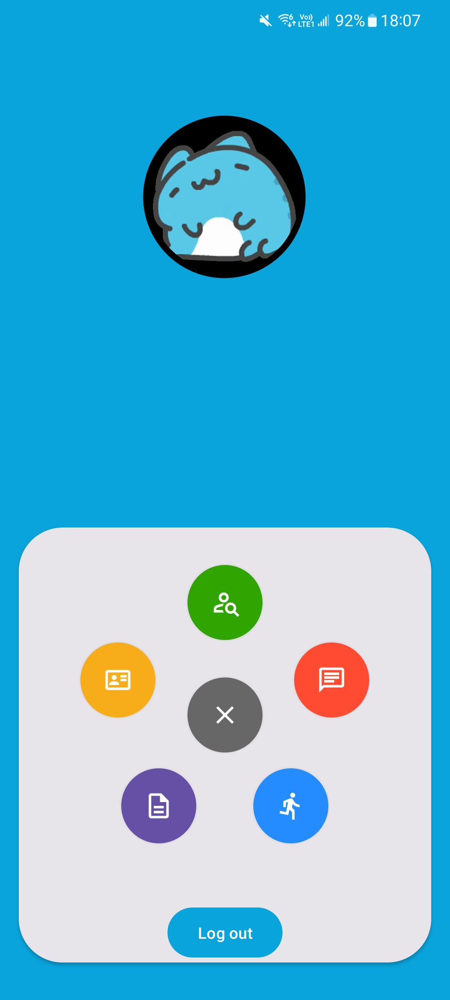
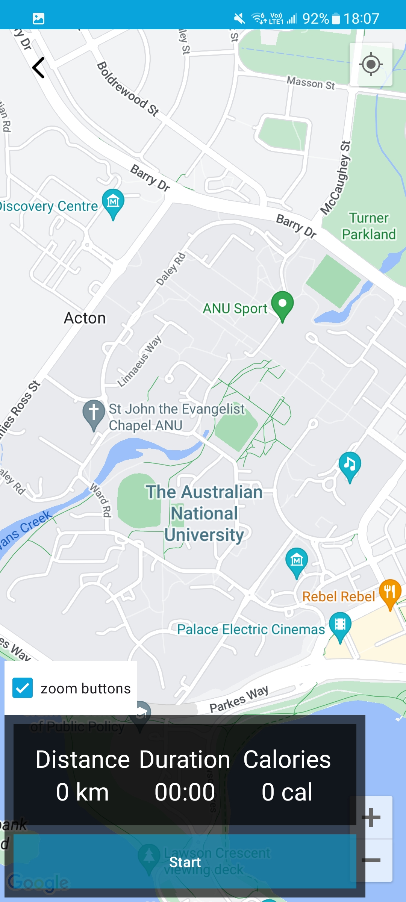
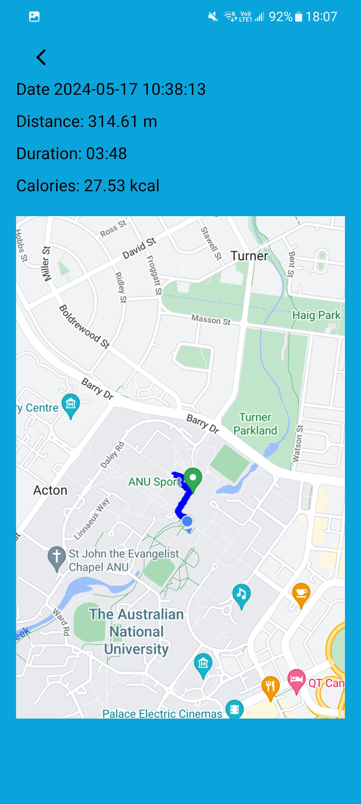

 

# **G48 - Kangarun**
**Team Members
u7724723	Qiutong Zeng
u7611510	Heng Sun
u6812566	Runyao Wang
u6508459	Bingnan Zhao
u7779907	Yan Jin**

 

###  
 Statement:This project is using API 34 to build the app, using API 33 might result in incompatibility 
 

 
Kangarun is a sports-centric social application designed for tracking your workouts. 
With Kangarun, you can log your exercise duration, calories burned, distance covered, 
and visualize your route through map images. You can also connect with workout buddies, 
chat, and exercise together.

 

## **Download**

 

   
   
   

 

## **Features**

- [Login] Allows users to login into the Kangarun application using their credentials, ensuring authenticated access to personalized content.

- [DataFiles] 2500 chat messages are created and uploaded into the database of firebase.

- [LoadShowData] User are capable of getting various information by accessing certain section of the application.

- [DataStream] Real-time synchronization and uploading of user data to Firebase.

- [Search] Users are able to search other users by username or tokens.

### Custom Features
- Feature Category: Search-related features
  - [Search-Filter] Sort and filter the search result

- Feature Category: Greater Data Usage, Handling and Sophistication
  - [Data-Profile] Create a Profile Page for Users or any Entities, which contains a media file
  - [Data-GPS] Use GPS information based on location data in your App.
  - [Data-Graphical] Create a Graphical report viewer to see a report of some useful data from your app.

- Feature Category: Firebase Integration 
  - [FB-Auth] Use Firebase to implement User Authentication/Authorisation
  - [FB-Persist] Use Firebase to persist all data used in your app

- Feature Category: Peer to Peer Messaging 
    - [P2P-DM] Users can chat with other users in a real-time direct message.
    - [P2P-Block]  Provide users with the ability to ‘block’ and prevent another user from direct messaging them

- Feature Category: Privacy
  - [Privacy-Block] Provide content providers (or users) with the ability to ‘block’ users (or contents/profiles). The user shall then not be able to view the relevant contents from search results. 

## Usage

#### Login and Registration
Use the provided credentials for testing:
Username: comp2100@anu.edu.au, Password: comp2100
Username: comp6442@anu.edu.au, Password: comp6442
#### Exercise Tracking
Start an exercise session from the main menu to track your route and performance in real-time.
#### Profile Management
Update your personal information and avatar from the profile section.
#### Chat and Social Features
Chat with friends and manage your friend list from the social section.

## Known Crashing Issues
Error 1:

An crash appears when user try to upload avatar, but user only open the folder and quit.
The reason it crashed is because there is no fail listener added to the inner layer.

Error 2:

An error message appears in the logcat when attempting to request a user's profile picture if it has not been set.
The default profile picture will be applied with the error. It does not affect any functionality.

 Error 3:
An white sreen flash with return to welcome page will happen when user leave username and password empty and press login
 This issue might cause crash, but most of time it won't

## Dependencies

This project uses the following third-party libraries:

- **lottie-android** (com.airbnb.android:lottie:3.4.0)
  - Licensed under the Apache License, Version 2.0. See the [LICENSE](https://github.com/airbnb/lottie-android/blob/master/LICENSE) for details.

- **Material Components For Android** (com.google.android.material:material:1.11.0)
  - Licensed under the Apache License, Version 2.0. See the [LICENSE](https://github.com/material-components/material-components-android/blob/master/LICENSE) for details.

- **ImagePicker** (com.github.dhaval2404:imagepicker:2.1)
  - Licensed under the Apache License, Version 2.0. See the [LICENSE](https://github.com/Dhaval2404/ImagePicker/blob/master/LICENSE) for details.

- **picasso** (com.squareup.picasso:picasso:2.8)
  - Licensed under the Apache License, Version 2.0. See the [LICENSE](https://github.com/square/picasso/blob/master/LICENSE.txt) for details.

- **MPAndroidChart** (com.github.PhilJay:MPAndroidChart:v3.1.0)
  - Licensed under the Apache License, Version 2.0. See the [LICENSE](https://github.com/PhilJay/MPAndroidChart/blob/master/LICENSE) for details.

## License

This project is licensed under the Apache License, Version 2.0. See the [LICENSE](https://gitlab.cecs.anu.edu.au/u7724723/gp-24s1/-/blob/main/LICENSE.txt) file for details.
