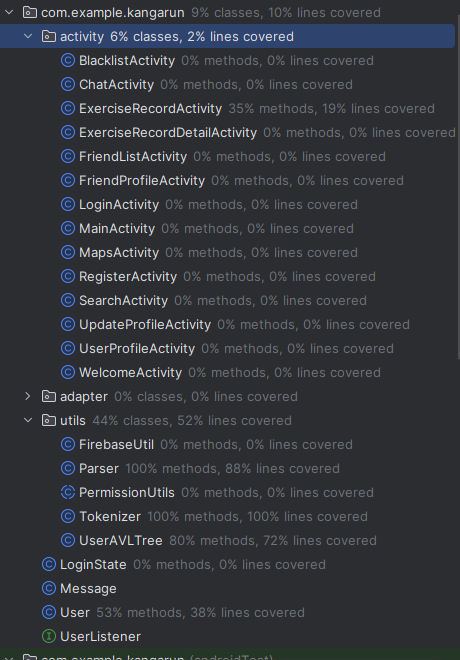

# [G48 - Kangarun] Report

###  
 Statement:This project is using API 34 to build the app, using API 33 might result in incompatibility 
 

## Table of Contents

- [[G48 - Kangarun] Report](#g48---kangarun-report)
      - [Statement](#statement-we-used-api-34-to-build-the-app-using-api-33-might-result-in-incompatibility)
  - [Table of Contents](#table-of-contents)
  - [Administrative](#administrative)
  - [Team Members and Roles](#team-members-and-roles)
  - [Summary of Individual Contributions](#summary-of-individual-contributions)
  - [Application Description](#application-description)
    - [Application Use Cases and or Examples](#application-use-cases-and-or-examples)
      - [Use Case 1: Casual Jogger](#use-case-1-casual-jogger)
      - [Use Case 2: Competitive Runner](#use-case-2-competitive-runner)
      - [Use Case 3: Fitness Trainer](#use-case-3-fitness-trainer)
      - [Use Case 4: Health Enthusiast](#use-case-4-health-enthusiast)
    - [Application UML](#application-uml)
  - [Code Design and Decisions](#code-design-and-decisions)
    - [Data Structures](#data-structures)
    - [Design Patterns](#design-patterns)
    - [Parser](#parser)
    - [Grammar(s)](#grammars)
    - [Tokenizers and Parsers](#tokenizers-and-parsers)
    - [Others](#others)
  - [Implemented Features](#implemented-features)
    - [Basic Features](#basic-features)
    - [Custom Features](#custom-features)
    - [Surprise Features](#surprise-features)
      - [Code smells](#code-smells)
  - [Summary of Known Errors and Bugs](#summary-of-known-errors-and-bugs)
  - [Testing Summary](#testing-summary)
  - [Team Management](#team-management)
    - [Meetings Records](#meetings-records)
    - [Conflict Resolution Protocol](#conflict-resolution-protocol)

## Administrative
- Firebase Repository Link: <insert-link-to-firebase-repository>
   - Confirm: I have already added comp21006442@gmail.com as a Developer to the Firebase project prior to due date.
- Two user accounts for markers' access are usable on the app's APK (do not change the username and password unless there are exceptional circumstances. Note that they are not real e-mail addresses in use):
   - Username: comp2100@anu.edu.au	Password: comp2100
   - Username: comp6442@anu.edu.au	Password: comp6442

## Team Members and Roles
The key area(s) of responsibilities for each member

| UID      |   Name   |                                              Role                                               |
|:---------|:--------:|:-----------------------------------------------------------------------------------------------:|
| u7724723 | Qiutong Zeng |                Responsible for Database Management, User profile, Firebase Auth                 |
| u7611510 | Heng Sun      |                  Responsible for exercise feature and exercise detail recoreds                  |
| u6812566 | Runyao Wang |                       Responsible for Message, Search and Social Network                        |
| u6508459 | Bingnan Zhao |              Responsible for exercise records and firestore and data upload script              |
| u7779907 |  Yan Jin  |                  Responsible for Login and both p2p and privacy Block function                  |

## Summary of Individual Contributions

1. **u7779907, Yan Jin**  I have 20% contribution, as follows:  
    - **Code Contribution in the final App**
        - LoginActivity.java: Developed the base structure for user login functionality.
          - [LoginActivity.java](https://gitlab.cecs.anu.edu.au/u7724723/gp-24s1/blob/main/MyApplication/app/src/main/java/com/example/kangarun/activity/LoginActivity.java)
          - [WelcomeActivity.java](https://gitlab.cecs.anu.edu.au/u7724723/gp-24s1/blob/main/MyApplication/app/src/main/java/com/example/kangarun/activity/WelcomeActivity.java)
        - Feature P2P-Block: Developed user blocking functionality to prevent direct messaging
          - [BlacklistActivity.java](https://gitlab.cecs.anu.edu.au/u7724723/gp-24s1/blob/main/MyApplication/app/src/main/java/com/example/kangarun/activity/BlacklistActivity.java)
          - [FriendProfileActivity.java](https://gitlab.cecs.anu.edu.au/u7724723/gp-24s1/blob/main/MyApplication/app/src/main/java/com/example/kangarun/activity/FriendProfileActivity.java)
          - [ChatActivity.java](https://gitlab.cecs.anu.edu.au/u7724723/gp-24s1/blob/main/MyApplication/app/src/main/java/com/example/kangarun/activity/ChatActivity.java)
        - Feature Privacy-Block: Implemented content blocking to prevent users from viewing certain profiles or content
          - [SearchActivity.java](https://gitlab.cecs.anu.edu.au/u7724723/gp-24s1/blob/main/MyApplication/app/src/main/java/com/example/kangarun/activity/SearchActivity.java)
          - [FriendListActivity.java](https://gitlab.cecs.anu.edu.au/u7724723/gp-24s1/blob/main/MyApplication/app/src/main/java/com/example/kangarun/activity/FriendListActivity.java)
    - **Code and App Design**
        - Developed the UI for displaying the list of blocked users, incorporating features for easy unblocking. 
        - Ensured that the blacklist interface aligns with the overall design and usability standards of the Kangarun app.
2. **u7724723, Qiutong Zeng**  I have 20% contribution, as follows:  
   - **Code Contribution in the final App**
      - Feature FB-Auth: Use firebase to verify user login and add register info to Firestore 
        - [LoginActivity.java](https://gitlab.cecs.anu.edu.au/u7724723/gp-24s1/-/blob/main/MyApplication/app/src/main/java/com/example/kangarun/activity/LoginActivity.java) & [RegisterActivity.java](https://gitlab.cecs.anu.edu.au/u7724723/gp-24s1/-/blob/main/MyApplication/app/src/main/java/com/example/kangarun/activity/RegisterActivity.java)
      - Feature FB-Persist: Use firebase to persist user profile 
        - [UserProfileActivity.java](https://gitlab.cecs.anu.edu.au/u7724723/gp-24s1/-/blob/main/MyApplication/app/src/main/java/com/example/kangarun/activity/UserProfileActivity.java) & [FriendProfileActivity.java](https://gitlab.cecs.anu.edu.au/u7724723/gp-24s1/-/blob/main/MyApplication/app/src/main/java/com/example/kangarun/activity/FriendProfileActivity.java)
      - Feature Data-Profile: Display personal information and an avatar for each user 
        - [UserProfileActivity.java](https://gitlab.cecs.anu.edu.au/u7724723/gp-24s1/-/blob/main/MyApplication/app/src/main/java/com/example/kangarun/activity/UserProfileActivity.java) &  [FriendProfileActivity.java](https://gitlab.cecs.anu.edu.au/u7724723/gp-24s1/-/blob/main/MyApplication/app/src/main/java/com/example/kangarun/activity/FriendProfileActivity.java)
      - Update avatar for user
        - [UpdateProfileActivity.java](https://gitlab.cecs.anu.edu.au/u7724723/gp-24s1/-/blob/main/MyApplication/app/src/main/java/com/example/kangarun/activity/UpdateProfileActivity.java)
   - **Code and App Design**
       - Implement media file display and upload through Picasso and imagepicker
       - Conceptualize the UI design of the entire app 
         - [activity_main.xml](https://gitlab.cecs.anu.edu.au/u7724723/gp-24s1/-/blob/main/MyApplication/app/src/main/res/layout/activity_main.xml)
         - [activity_login.xml](https://gitlab.cecs.anu.edu.au/u7724723/gp-24s1/-/blob/main/MyApplication/app/src/main/res/layout/activity_login.xml)
         - [activity_update_profile.xml](https://gitlab.cecs.anu.edu.au/u7724723/gp-24s1/-/blob/main/MyApplication/app/src/main/res/layout/activity_update_profile.xml)
         - [activity_user_profile.xml](https://gitlab.cecs.anu.edu.au/u7724723/gp-24s1/-/blob/main/MyApplication/app/src/main/res/layout/activity_user_profile.xml)
         - [activity_friend_profile.xml](https://gitlab.cecs.anu.edu.au/u7724723/gp-24s1/-/blob/main/MyApplication/app/src/main/res/layout/activity_friend_profile.xml)
       - Implement circular Menu through CircleMenur  

3. **u7611510, HengSun**  I have 20% contribution, as follows:  
   - **Code Contribution in the final App**
       - Feature Data-GPS: use Google Maps api to display map, locate the movement position in real time, continuously draw poly line according to the user's position in the map,  calculate the movement distance, time, and calories in real time 
         - [MapsActivity.java](https://gitlab.cecs.anu.edu.au/u7724723/gp-24s1/-/blob/main/MyApplication/app/src/main/java/com/example/kangarun/activity/MapsActivity.java)
       - Feature FB-Persist: use firebase to persist user exercise record
         - [MapsActivity.java](https://gitlab.cecs.anu.edu.au/u7724723/gp-24s1/-/blob/main/MyApplication/app/src/main/java/com/example/kangarun/activity/MapsActivity.java)
       - Feature Data-graphical: get user exercise record from firebase,
       display exercise record in detail including exercise path img,distance,duration,date
         - [ExerciseRecordDetailActivity.java](https://gitlab.cecs.anu.edu.au/u7724723/gp-24s1/-/blob/main/MyApplication/app/src/main/java/com/example/kangarun/activity/ExerciseRecordDetailActivity.java)
         - [ExerciseRecordAdapter.java](https://gitlab.cecs.anu.edu.au/u7724723/gp-24s1/-/blob/main/MyApplication/app/src/main/java/com/example/kangarun/adapter/ExerciseRecordAdapter.java)
        - Implementing the login state as a singleton ensures consistent access and efficient resource management throughout the application.
          - [LoginState,java](https://gitlab.cecs.anu.edu.au/u7724723/gp-24s1/-/blob/main/MyApplication/app/src/main/java/com/example/kangarun/LoginState.java) 
   - **Code and App Design**
       - proposed using AVL tree to store the friend relationship data structure, which can reduce the query waiting time   

4. **u6812566, Runyao Wang**  I have 20% contribution, as follows:  
   - **Code Contribution in the final App**
       - Feature P2P-DM: Real-time messaging implementation and relative UI -
         - [ChatActivity.java](https://gitlab.cecs.anu.edu.au/u7724723/gp-24s1/-/blob/main/MyApplication/app/src/main/java/com/example/kangarun/activity/ChatActivity.java),
         - [ChatAdapter.java](https://gitlab.cecs.anu.edu.au/u7724723/gp-24s1/-/blob/main/MyApplication/app/src/main/java/com/example/kangarun/adapter/ChatAdapter.java),
         - [activity_chat.xml](https://gitlab.cecs.anu.edu.au/u7724723/gp-24s1/-/blob/main/MyApplication/app/src/main/res/layout/activity_login.xml)
       - Feature Search: Search user by username or tokens(see [Parser](#parser)) with AVL tree.
         - [SearchActivity.java](https://gitlab.cecs.anu.edu.au/u7724723/gp-24s1/-/blob/main/MyApplication/app/src/main/java/com/example/kangarun/activity/SearchActivity.java),
         - [UserAVLTree.java](https://gitlab.cecs.anu.edu.au/u7724723/gp-24s1/-/blob/main/MyApplication/app/src/main/java/com/example/kangarun/utils/UserAVLTree.java), [Tokenizer.java](https://gitlab.cecs.anu.edu.au/u7724723/gp-24s1/-/blob/main/MyApplication/app/src/main/java/com/example/kangarun/utils/Tokenizer.java), [Parser.java](https://gitlab.cecs.anu.edu.au/u7724723/gp-24s1/-/blob/main/MyApplication/app/src/main/java/com/example/kangarun/utils/Parser.java)
       - Feature Search-Filter: Sort and filter the search result 
         - [SearchActivity.java](https://gitlab.cecs.anu.edu.au/u7724723/gp-24s1/-/blob/main/MyApplication/app/src/main/java/com/example/kangarun/activity/SearchActivity.java).
       - User adapter to create list to display users in search result and friends list -
         - [UserAdapter.java](https://gitlab.cecs.anu.edu.au/u7724723/gp-24s1/-/blob/main/MyApplication/app/src/main/java/com/example/kangarun/adapter/UserAdapter.java), 
       - Chat adapter to display messages in list 
         - [ChatAdapter.java](https://gitlab.cecs.anu.edu.au/u7724723/gp-24s1/-/blob/main/MyApplication/app/src/main/java/com/example/kangarun/adapter/ChatAdapter.java)
       - Add/delete friend 
         - [FriendProfileActivity.java](https://gitlab.cecs.anu.edu.au/u7724723/gp-24s1/-/blob/main/MyApplication/app/src/main/java/com/example/kangarun/activity/FriendProfileActivity.java)
       - Friend list 
         - [FriendListActivity.java](https://gitlab.cecs.anu.edu.au/u7724723/gp-24s1/-/blob/main/MyApplication/app/src/main/java/com/example/kangarun/activity/FriendListActivity.java)
   - **Code and App Design**
       - Use Recycle view and adapter to display list items (user list, messages)  

5. **u6508459, Bingnan Zhao**  I have 20% contribution, as follows:  
   - **Code Contribution in the final App**
       - Feature Exercise Record: Check exercise history in different orders.
          - [ExerciseRecordActivity.java](https://gitlab.cecs.anu.edu.au/u7724723/gp-24s1/-/blob/main/MyApplication/app/src/main/java/com/example/kangarun/activity/ExerciseRecordActivity.java)
          - [ExerciseRecordAdapter.java](https://gitlab.cecs.anu.edu.au/u7724723/gp-24s1/-/blob/main/MyApplication/app/src/main/java/com/example/kangarun/adapter/ExerciseRecordAdapter.java)
       - Template method for adapters
          - [BaseAdapter.java](https://gitlab.cecs.anu.edu.au/u7724723/gp-24s1/-/blob/main/MyApplication/app/src/main/java/com/example/kangarun/adapter/BaseAdapter.java)
          - [BlacklistUserAdapter.java](https://gitlab.cecs.anu.edu.au/u7724723/gp-24s1/-/blob/main/MyApplication/app/src/main/java/com/example/kangarun/adapter/BlacklistUserAdapter.java)
          - [ChatAdapter.java](https://gitlab.cecs.anu.edu.au/u7724723/gp-24s1/-/blob/main/MyApplication/app/src/main/java/com/example/kangarun/adapter/ChatAdapter.java)
          - [ExerciseRecordAdapter.java](https://gitlab.cecs.anu.edu.au/u7724723/gp-24s1/-/blob/main/MyApplication/app/src/main/java/com/example/kangarun/adapter/ExerciseRecordAdapter.java)
          - [UserAdapter.java](https://gitlab.cecs.anu.edu.au/u7724723/gp-24s1/-/blob/main/MyApplication/app/src/main/java/com/example/kangarun/adapter/UserAdapter.java)
       - Script to create test messages
          - [create_chat.py](https://gitlab.cecs.anu.edu.au/u7724723/gp-24s1/-/blob/main/items/script/create_chat.py)
   - **Code and App Design**
       - Designed template method and proposed the use of singleton
       - UI for maps activity and exercise record activity.

## Application Description
Kangarun is a sports-centric social application designed for tracking your every workout. With our app, you can log your exercise duration, calories burned, distance covered, and even visualize your route through map images. You can add your workout buddies to the app, chat with them, hang out, and exercise together.

### Application Use Cases and or Examples
#### Use Case 1: Casual Jogger
- **User**: Alex, a college student who jogs casually.
- **Goal**: To stay fit and share activities with friends.
- **Actions**:
    1. Alex logs into Kangarun to start a jogging session, using the app to track his route and performance.
    2. After the jog, he reviews the distance covered and calories burned displayed on the app.
    3. He shares his running route and stats on his Kangarun feed, receiving likes and comments from friends.
    4. Alex checks his friends' recent activities on the app to stay motivated and plans joint runs.

#### Use Case 2: Competitive Runner
- **User**: Maria, a competitive runner training for a marathon.
- **Goal**: To optimize training and track performance over time.
- **Actions**:
    1. Maria uses Kangarun's advanced features to monitor detailed stats like pace, elevation, and heart rate.
    2. She sets personal goals in the app and tracks her progress against these targets.
    3. Maria analyzes the comprehensive data collected to adjust her training regimen.
    4. She participates in virtual challenges and competitions through Kangarun to rank her performance against others.

#### Use Case 3: Fitness Trainer
- **User**: John, a fitness trainer.
- **Goal**: To manage his clients' workouts and motivate them.
- **Actions**:
    1. John creates group activities for his clients on Kangarun and monitors their participation.
    2. He reviews each client's activity data to provide personalized feedback and adjustments to their exercise plans.
    3. John uses the app's messaging feature to send motivational messages and workout tips.
    4. He organizes weekly challenges through the app to encourage competition and community among his clients.

#### Use Case 4: Health Enthusiast
- **User**: Linda, who is focused on overall wellness and likes to keep a healthy lifestyle.
- **Goal**: To maintain a balanced exercise routine and connect with like-minded individuals.
- **Actions**:
    1. Linda uses Kangarun to track various types of activities, including running, cycling, and yoga.
    2. She follows her friends and joins public groups within the app to find inspiration and new workout ideas.
    3. Linda shares her own tips and success stories, engaging with others through comments and messages.
    4. She uses the app’s reminder feature to keep a consistent workout schedule.

 

### Application UML
  

## Code Design and Decisions
 

### Data Structures

1. *AVL Tree*
   * *Objective: used for storing user information for search feature.*
   * *Code Locations: defined in [UserAVLTree.java](https://gitlab.cecs.anu.edu.au/u7724723/gp-24s1/-/blob/main/MyApplication/app/src/main/java/com/example/kangarun/utils/UserAVLTree.java); processed using [SearchActivity.java](https://gitlab.cecs.anu.edu.au/u7724723/gp-24s1/-/blob/main/MyApplication/app/src/main/java/com/example/kangarun/activity/SearchActivity.java).
   * *Reasons:*
      * *It is more efficient than Arraylist for search with a time complexity O(log(n))*
      * *The tree is created upon app start to reduce the number of requests to firebase*

2. *ArrayList*
   * *Objective: Used for managing dynamic collections of user-generated content such as records or messages.*
   * *Code Locations: [FriendListActivity.java](https://gitlab.cecs.anu.edu.au/u7724723/gp-24s1/blob/main/MyApplication/app/src/main/java/com/example/kangarun/activity/FriendListActivity.java), [BlacklistActivity.java](https://gitlab.cecs.anu.edu.au/u7724723/gp-24s1/blob/main/MyApplication/app/src/main/java/com/example/kangarun/activity/BlacklistActivity.java)*
   * *Reasons:*
     * *Allows for flexible size adjustments, accommodating an unpredictable number of posts or comments dynamically loaded from Firebase.*
     * *Provides efficient random access to elements, which is advantageous when displaying or sorting posts in the user feed.*

3. *Map*
   * *Objective: used for tokenizing and parsing user input data for structured processing.*
   * *Code Locations: [tokenizer](https://gitlab.cecs.anu.edu.au/u7724723/gp-24s1/-/blob/main/MyApplication/app/src/main/java/com/example/kangarun/utils/Tokenizer.java) and [parser](https://gitlab.cecs.anu.edu.au/u7724723/gp-24s1/-/blob/main/MyApplication/app/src/main/java/com/example/kangarun/utils/Parser.java)*
   * *Reasons:*
     * *The Map structure allows for efficient storage and retrieval of key-value pairs, making it ideal for managing tokenized input data.*
     * *It enables easy management of key-value pairs, ensuring that data is structured and can be quickly accessed or modified.*
     * *The Map structure can handle varying amounts of data and can be easily scaled to accommodate more keys and values as needed.*

4. *HashMap*
   * *Objective: used for constructing a message payload to be sent to Firestore for chat functionality.*
   * *Code Locations: [ChatActivity.java](https://gitlab.cecs.anu.edu.au/u7724723/gp-24s1/-/blob/main/MyApplication/app/src/main/java/com/example/kangarun/activity/ChatActivity.java)*
   * *Reasons:*
     * *The HashMap allows for easy construction of a message payload with dynamic key-value pairs, making it flexible to add or modify data fields as needed.*
     * *The HashMap structure is compatible with Firestore's data model, making it straightforward to convert the map into a Firestore document.*
     * *Provides efficient insertion and lookup operations, ensuring quick access and modification of message data.*

### Design Patterns
*[What design patterns did your team utilise? Where and why?]*

1. *Singleton Pattern*
   * *Objective: used for storing user information for all features that needs user information.*
   * *Code Locations: defined in [LoginState.java, methods getInstance](https://gitlab.cecs.anu.edu.au/u7724723/gp-24s1/-/blob/main/MyApplication/app/src/main/java/com/example/kangarun/LoginState.java) 
   * *Reasons:*
      * used to ensure that a class has only one instance and provides a global point of access to that instance. It is useful to control access to a shared resource or manage global state within an application.

2. *DAO Pattern*
   * *Objective: storing data access object.*
   * *Code Locations: defined in [User.java](https://gitlab.cecs.anu.edu.au/u7724723/gp-24s1/-/blob/main/MyApplication/app/src/main/java/com/example/kangarun/User.java) & [Message.java](https://gitlab.cecs.anu.edu.au/u7724723/gp-24s1/-/blob/main/MyApplication/app/src/main/java/com/example/kangarun/AdminUser.java)
   * *Reasons:*
      * used to separate the business logic from the data persistence logic, promoting better code organization and maintainability. It abstracts the database operations, providing a clean interface for accessing and manipulating data, which enhances code readability and reusability.

3. *Template Pattern*
   * *Objective: used to promote code reuse by placing the common structure in the base adapter, while specific details are implemented in the subclasses.*
   * *Code Locations: defined in [BaseAdaptor.java](https://gitlab.cecs.anu.edu.au/u7724723/gp-24s1/-/blob/main/MyApplication/app/src/main/java/com/example/kangarun/adapter/BaseAdapter.java) & [ChatAdapter.java](https://gitlab.cecs.anu.edu.au/u7724723/gp-24s1/-/blob/main/MyApplication/app/src/main/java/com/example/kangarun/adapter/ChatAdapter.java) & [ExerciseRecordAdapter.java](https://gitlab.cecs.anu.edu.au/u7724723/gp-24s1/-/blob/main/MyApplication/app/src/main/java/com/example/kangarun/adapter/ExerciseRecordAdapter.java) &[UserAdapter.java](https://gitlab.cecs.anu.edu.au/u7724723/gp-24s1/-/blob/main/MyApplication/app/src/main/java/com/example/kangarun/adapter/UserAdapter.java) & [BlacklistUserAdapter.java](https://gitlab.cecs.anu.edu.au/u7724723/gp-24s1/-/blob/main/MyApplication/app/src/main/java/com/example/kangarun/adapter/BlacklistUserAdapter.java)
   * *Reasons:*
      * used to define the skeleton of an algorithm in a superclass but allows subclasses to override specific steps of the algorithm without changing its structure. This promotes code reuse and allows for variation in behavior among subclasses while maintaining a common workflow.

### Parser

### <u>Grammar(s)</u>
*[How do you design the grammar? What are the advantages of your designs?]*
*If there are several grammars, list them all under this section and what they relate to.*

Production Rules:

    <query> ::= <field>
    <query> ::= <field><separator><query>
    <field> ::= <username_field> | <email_field> | <gender_field>
    <username_field> ::= "name="<username>
    <email_field> ::= "email="<email>
    <gender_field> ::= "gender="<gender>
    
Terminals:

    <username>, <email> ::= Any string doesn't include = or ;
    <gender> ::= m | f | o
    <separator> ::= ;
*The gender terminals represents male, female and other genders respectively.

### <u>Tokenizers and Parsers</u>

Tokenizer and Parser are used in user search with tokens. The search grammar is stated above.
An simple query example would be:

    name=1;email=1;gender=f
There should be at least one field and the order of fields doesn't matter.

The tokenizer for this grammar splits the input query into tokens using the semicolon ";" as a delimiter. Each token represents a potential field within the query based on the prefix ("name=", "email=", "gender=").

With the tokens generated by the tokenizer, the parser verifies each token against the grammar rules. It checks if each token correctly fits the expected format for the field it represents, and data integrity is therefore ensured.
 
Using tokenized search enriches the possibility and accuracy of current search function. It is designed for who wants to find a specific group of users.

## Implemented Features
 

### Basic Features
1. [LogIn]. Allows users to log into the Kangarun application using their credentials, ensuring authenticated access to personalized content.
    * Code: [LoginActivity.java](https://gitlab.cecs.anu.edu.au/u7724723/gp-24s1/-/blob/main/MyApplication/app/src/main/java/com/example/kangarun/activity/LoginActivity.java)
    * Developed the basic structure for user login functionality using Firebase authentication. 
    * Integrated Firebase authentication to verify user credentials and ensure secure access. 

2. [DataFiles]. 2500 chat messages are created and uploaded into the database of firebase.
   * Chat data is structured as [Message Class](https://gitlab.cecs.anu.edu.au/u7724723/gp-24s1/-/blob/main/MyApplication/app/src/main/java/com/example/kangarun/Message.java) and upload to firestore.
   * Link to the Firebase repo: [COMP6442](https://console.firebase.google.com/u/1/project/comp6442-e1d42/overview)
   * The data is generated by a simple script [create_chat](https://gitlab.cecs.anu.edu.au/u7724723/gp-24s1/-/blob/main/items/script/create_chat.py), and uploaded to firestore via firebase admin SDK.
   * The script randomly pick two users from all users, register them as friends if they are not, and pick random line from a article. It uses these information to create a message instance for uploading.

3. [LoadShowData] User are capable of getting various information by accessing certain section of the application.
   * The information of current user's own profile are loaded from firestore and shown in [UserProfileActivity](https://gitlab.cecs.anu.edu.au/u7724723/gp-24s1/-/blob/main/MyApplication/app/src/main/java/com/example/kangarun/activity/UserProfileActivity.java)
   * Chat messages are loaded and shown in [ChatActivity](https://gitlab.cecs.anu.edu.au/u7724723/gp-24s1/-/blob/main/MyApplication/app/src/main/java/com/example/kangarun/activity/ChatActivity.java)
   * User's previous exercise records are loaded and shown in [ExerciseRecordActivity](https://gitlab.cecs.anu.edu.au/u7724723/gp-24s1/-/blob/main/MyApplication/app/src/main/java/com/example/kangarun/activity/ExerciseRecordActivity.java)
   * Detail information of each record is shown in [ExerciseRecordDetailActivity](https://gitlab.cecs.anu.edu.au/u7724723/gp-24s1/-/blob/main/MyApplication/app/src/main/java/com/example/kangarun/activity/ExerciseRecordDetailActivity.java)
   * User's friends are shown in [FriendListActivity](https://gitlab.cecs.anu.edu.au/u7724723/gp-24s1/-/blob/main/MyApplication/app/src/main/java/com/example/kangarun/activity/FriendListActivity.java) and blacklist members are shown in [BackListActivity](https://gitlab.cecs.anu.edu.au/u7724723/gp-24s1/-/blob/main/MyApplication/app/src/main/java/com/example/kangarun/activity/BlacklistActivity.java)
    
4. [DataStream] Real-time synchronization and uploading of user data to Firebase.
    * Chat messages are created and uploaded to firebase in [ChatActivity](https://gitlab.cecs.anu.edu.au/u7724723/gp-24s1/-/blob/main/MyApplication/app/src/main/java/com/example/kangarun/activity/ChatActivity.java)
    * Adding or removing a user from friend or block list is synchronized with firebase in [FriendProfileActivity.java](https://gitlab.cecs.anu.edu.au/u7724723/gp-24s1/-/blob/main/MyApplication/app/src/main/java/com/example/kangarun/activity/FriendProfileActivity.java)
    * When a user completes an exercise session, the details of the session (e.g., duration, distance, route map) are uploaded to Firebase. [ExerciseRecordActivity](https://gitlab.cecs.anu.edu.au/u7724723/gp-24s1/-/blob/main/MyApplication/app/src/main/java/com/example/kangarun/activity/ExerciseRecordActivity.java)
     
5. [Search]. Users are able to search other users by username or tokens.
    * Code: [SearchActivity.java](https://gitlab.cecs.anu.edu.au/u7724723/gp-24s1/-/blob/main/MyApplication/app/src/main/java/com/example/kangarun/activity/SearchActivity.java), [UserAVLTree.java](https://gitlab.cecs.anu.edu.au/u7724723/gp-24s1/-/blob/main/MyApplication/app/src/main/java/com/example/kangarun/utils/UserAVLTree.java), [Tokenizer.java](https://gitlab.cecs.anu.edu.au/u7724723/gp-24s1/-/blob/main/MyApplication/app/src/main/java/com/example/kangarun/utils/Tokenizer.java), [Parser.java](https://gitlab.cecs.anu.edu.au/u7724723/gp-24s1/-/blob/main/MyApplication/app/src/main/java/com/example/kangarun/utils/Parser.java)
    * The search function offers users the option to perform either a token-based search, which follows a predefined context-free grammar (CFG) as described above, or a simpler partial username search. 
      If the user's input is not tokenizable, the system will automatically perform a search based on partial username matches.
    * Both search method utilize an AVL tree algorithm. All user data is inserted into an AVL tree when the app starts. Then the search activity determines the appropriate search method based on user query, and invoke corresponding search method in the AVL tree.
    
### Custom Features
1. Feature Category: Search-related features 
   [Search-Filter]. Sort and filter the search result
    * Code: [SearchActivity.java](https://gitlab.cecs.anu.edu.au/u7724723/gp-24s1/-/blob/main/MyApplication/app/src/main/java/com/example/kangarun/activity/SearchActivity.java)
    * Sort button to sort by username or email. Filter button for user-selected gender.
    * Based on O(n logn) Collеctions.sort()
        
2. Feature Category: Greater Data Usage, Handling and Sophistication 
   [Data-Profile] Create a Profile Page for Users or any Entities, which contains a media file 
    * Code: [UserProfileActivity.java](https://gitlab.cecs.anu.edu.au/u7724723/gp-24s1/-/blob/main/MyApplication/app/src/main/java/com/example/kangarun/activity/UserProfileActivity.java#L65-72)
    * Used the external library (Following the open source agreement) Picasso to read and display images.
     

   [Data-GPS] Use GPS information based on location data in your App.
    * Code: [Class MapsActivity, method getCurrentLocation](https://gitlab.cecs.anu.edu.au/u7724723/gp-24s1/-/blob/main/MyApplication/app/src/main/java/com/example/kangarun/activity/MapsActivity.java#L238-L250)
    * Use FusedLocationProviderClient to obtain the user's location information, and according to user current location on the map.   

   [Data-Graphical] Create a Graphical report viewer to see a report of some useful data from your app.
    * An image of previous exercise route on the map is shown in [Class MapsActivity,methods captureMapSnapshot, uploadMapSnapshotToFirebase](https://gitlab.cecs.anu.edu.au/u7724723/gp-24s1/-/blob/main/MyApplication/app/src/main/java/com/example/kangarun/activity/MapsActivity.java#L332-L370) lines of 332 to 370
    * The graphical is generated by captureMapSnapshot method and stored to firebase by uploadMapSnapshotToFirebase function 
    * A line chart with seven days of exercise statistics is presented at the bottom of [ExerciseRecord](https://gitlab.cecs.anu.edu.au/u7724723/gp-24s1/-/blob/main/MyApplication/app/src/main/java/com/example/kangarun/activity/ExerciseRecordActivity.java) page.
    * It runs through all records, gets the summary of data in last 7 days, and make them into a line chart.  

3. Feature Category: Firebase Integration  
   [FB-Auth] Use Firebase to implement User Authentication/Authorisation
      * Code: [LoginActivity.java](https://gitlab.cecs.anu.edu.au/u7724723/gp-24s1/-/blob/main/MyApplication/app/src/main/java/com/example/kangarun/activity/LoginActivity.java) & [RegisterActivity.java](https://gitlab.cecs.anu.edu.au/u7724723/gp-24s1/-/blob/main/MyApplication/app/src/main/java/com/example/kangarun/activity/RegisterActivity.java)
      * By using firebase Authentication, the user's login verification password and email address are implemented, ensuring security. This is somewhat more secure than local authentication.
     

   [FB-Persist] Use Firebase to persist all data used in your app
      * Code: [UserProfileActivity.java](https://gitlab.cecs.anu.edu.au/u7724723/gp-24s1/-/blob/main/MyApplication/app/src/main/java/com/example/kangarun/activity/UserProfileActivity.java), [MapsActivity.java](https://gitlab.cecs.anu.edu.au/u7724723/gp-24s1/-/blob/main/MyApplication/app/src/main/java/com/example/kangarun/activity/MapsActivity.java#L100-144), [FriendProfileActivity.java](https://gitlab.cecs.anu.edu.au/u7724723/gp-24s1/-/blob/main/MyApplication/app/src/main/java/com/example/kangarun/activity/FriendProfileActivity.java#L66-99), [ExerciseRecordActivity.java](https://gitlab.cecs.anu.edu.au/u7724723/gp-24s1/-/blob/main/MyApplication/app/src/main/java/com/example/kangarun/activity/ExerciseRecordActivity.java#L74-157), [BlacklistActivity.java](https://gitlab.cecs.anu.edu.au/u7724723/gp-24s1/-/blob/main/MyApplication/app/src/main/java/com/example/kangarun/activity/BlacklistActivity.java#L65-107), [ChatActivity.java](https://gitlab.cecs.anu.edu.au/u7724723/gp-24s1/-/blob/main/MyApplication/app/src/main/java/com/example/kangarun/activity/ChatActivity.java#L104), [FriendListActivity.java](https://gitlab.cecs.anu.edu.au/u7724723/gp-24s1/-/blob/main/MyApplication/app/src/main/java/com/example/kangarun/activity/FriendListActivity.java#L46-94), [FriendProfileActivity.java](https://gitlab.cecs.anu.edu.au/u7724723/gp-24s1/-/blob/main/MyApplication/app/src/main/java/com/example/kangarun/activity/FriendProfileActivity.java) & [SearchActivity.java](https://gitlab.cecs.anu.edu.au/u7724723/gp-24s1/-/blob/main/MyApplication/app/src/main/java/com/example/kangarun/activity/SearchActivity.java#L97-134)
      * We store all the user data, sport record, friend list, black list, history chat and image in the firestore & firebase storage. 
       
               
    
  

4. Feature Category: Peer to Peer Messaging  
   [P2P-DM] Users can chat with other users in a real-time direct message
    * Code: [ChatActivity.java](https://gitlab.cecs.anu.edu.au/u7724723/gp-24s1/-/blob/main/MyApplication/app/src/main/java/com/example/kangarun/activity/ChatActivity.java),
      [activity_chat.xml](https://gitlab.cecs.anu.edu.au/u7724723/gp-24s1/-/blob/main/MyApplication/app/src/main/res/layout/activity_login.xml), [ChatAdapter.java](https://gitlab.cecs.anu.edu.au/u7724723/gp-24s1/-/blob/main/MyApplication/app/src/main/java/com/example/kangarun/adapter/ChatAdapter.java)
    * It is based on Firestore for persistent and real-time data synchronization, ensuring that messages are consistently updated and displayed. The messages are displayed by a recycle view adapter to handle asynchronous data loading and UI updates to provide a responsive user experience.  

   [P2P-Block] Provide users with the ability to ‘block’ and prevent another user from direct messaging
them
    * Code:[FriendListActivity.java](uhttps://gitlab.cecs.anu.edu.au/u7724723/gp-24s1/blob/main/MyApplication/app/src/main/java/com/example/kangarun/activity/FriendListActivity.java)
    * [ChatActivity.java](https://gitlab.cecs.anu.edu.au/u7724723/gp-24s1/blob/main/MyApplication/app/src/main/java/com/example/kangarun/activity/ChatActivity.java)
    * Description of your implementation: Implemented the blacklist activity to display a list of blocked users and manage block/unblock functionality. Integrated with Firebase to fetch and update the block list in real-time.
    * Added block/unblock functionality in the friend profile activity to allow users to manage their block list directly from the user's profile.
        
1. Feature Category: Privacy 
   [Privacy-Block] Provide content providers (or users) with the ability to ‘block’ users (or
contents/profiles). The user shall then not be able to view the relevant contents from search results. 
    * Code: [BlacklistActivity.java](https://gitlab.cecs.anu.edu.au/u7724723/gp-24s1/blob/main/MyApplication/app/src/main/java/com/example/kangarun/activity/BlacklistActivity.java), [activity_blacklist.xml](https://gitlab.cecs.anu.edu.au/u7724723/gp-24s1/blob/main/MyApplication/app/src/main/res/layout/activity_blacklist.xml)
    * Description of your implementation: Modified the friend list activity to exclude blocked users from appearing in the friend list and search results.
    * Managed the block list through Firebase integration and dynamically updated the user interface based on the current block list.   

### Surprise Features
#### Code smells
* Code smell 1: query firebase every time when need the current logged-in user id 
  (https://gitlab.cecs.anu.edu.au/u7724723/gp-24s1/-/commit/b3ad484654b3e47cd1f61cf7823f55c876ed115b)
  (https://gitlab.cecs.anu.edu.au/u7724723/gp-24s1/-/commit/53262b4b45eae4306f61cb2f934c41727372c747)
  (https://gitlab.cecs.anu.edu.au/u7724723/gp-24s1/-/commit/a6a55fd24aa3ed89d328f2eed747fec09b240991)

    - Correction:

      The code has been improved by leveraging a singleton login state to directly access the current user's ID instead of querying Firebase repeatedly. This modification enhances performance by eliminating redundant database calls and enhances code clarity by centralizing user authentication data management. 
      (https://gitlab.cecs.anu.edu.au/u7724723/gp-24s1/-/commit/44701b1ae64f375620857c36aa6ff8f988971510)
      (https://gitlab.cecs.anu.edu.au/u7724723/gp-24s1/-/commit/deeb9c917d327177cff5ddb1ce183be0f390b618)
      (https://gitlab.cecs.anu.edu.au/u7724723/gp-24s1/-/commit/9b59babaa79722d0fc546670405666e7d7a990a9)
      (https://gitlab.cecs.anu.edu.au/u7724723/gp-24s1/-/commit/9765590f50a7f8b489bf2066b7f5d52e8941fc2d)
      (https://gitlab.cecs.anu.edu.au/u7724723/gp-24s1/-/commit/e3f3bad97b29a4428455f6d8fcd041ad428c66a8)
      (https://gitlab.cecs.anu.edu.au/u7724723/gp-24s1/-/commit/82411964179f30bad0735de79696db58b74b90d6)

   
* Code smell 2: Many adaptors have similar functionality without using the template pattern 
  (https://gitlab.cecs.anu.edu.au/u7724723/gp-24s1/-/commit/82f7dfe31026057d045af06873274a665eb643b0)
  (https://gitlab.cecs.anu.edu.au/u7724723/gp-24s1/-/commit/624c27bb412c5b7d4629a78cc525ec57ef87c2cb)
  (https://gitlab.cecs.anu.edu.au/u7724723/gp-24s1/-/commit/cce2b1f2a6dbeb5895107ba895030660ba00f2f3)
  (https://gitlab.cecs.anu.edu.au/u7724723/gp-24s1/-/commit/de77f53b1aadd61c1c38bf2a783547997029e824)
    - Correction:   The adapters have been refactored to adhere to the template method pattern by introducing a BaseAdapter template class. This pattern abstracts the common functionality shared among adapters while allowing subclasses to implement specific details. Now, each adapter extends the BaseAdapter and overrides methods as needed, promoting code reuse and maintaining a consistent structure across adapters.
      (https://gitlab.cecs.anu.edu.au/u7724723/gp-24s1/-/commit/c6d72c0d1b55c8a4d9b6a42aa4d59f9a6dbe435a)

   
* Code smell 3: The display of data is not restricted to two decimal places, resulting in a lot of screen space being used to display meaningless decimals
  (https://gitlab.cecs.anu.edu.au/u7724723/gp-24s1/-/commit/624c27bb412c5b7d4629a78cc525ec57ef87c2cb)
   

* Code smell 4: AVL tree type issue
    - The AVL tree was using lab code with improper type declaration. It has complicated class inheritance to fit different types of data. It needs to cast every time used.
      (https://gitlab.cecs.anu.edu.au/u7724723/gp-24s1/-/commit/574b6b8d75e7d88804f15b06669275077451b82b)
    - Correction:
      Create an AVL tree for specific type User. It is significantly easier to invoke and readability improved. (https://gitlab.cecs.anu.edu.au/u7724723/gp-24s1/-/commit/53262b4b45eae4306f61cb2f934c41727372c747)
       

## Summary of Known Errors and Bugs

1. *Bug 1:*
   - *The button on home page sometimes gets smaller*
   - The reason it gets smaller is because we used third party library to achiece dynamic effect, but it seems that the third party library has some bug we can't fix.
2. *Bug 2:*
   - *The length of chat message container is fixed. It may looks weird in landscape mode.*
    - The reason of fixed container width is to eliminate extra spaces with *wrap_content(0dp)* in Recycle View.
3. *Bug 3:*
   - When user finished upload avatar, if user return to last page, they won't see the avatar update, but when they return to the main page, they will see the update.
4. *Bug 4:*
   - *There will be a 404 error when trying to display profile image when that user actually have no profile image in database*

5. *Error 1:*
    - An crash appears when user try to upload avatar, but user only open the folder and quit.
    - The reason it crashed is because there is no fail listener added to the inner layer.
6. *Error 2:*
   - *An error message appears in the logcat when attempting to request a user's profile picture if it has not been set.*
    - The default profile picture will be applied with the error. It does not affect any functionality.
7. *Error 3:*
   - An white sreen flash with return to welcome page will happen when user leave username and password empty and press login
   - This issue might cause crash, but most of time it won't

    
  
  

## Testing Summary

*[What features have you tested? What is your testing coverage?]*
*Please provide some screenshots of your testing summary, showing the achieved testing coverage. Feel free to provide further details on your tests.*

*Please use [Scripted configuration](https://gitlab.cecs.anu.edu.au/u7724723/gp-24s1/-/blob/main/MyApplication/.run/Tests%20in%20'com.example.kangarun'.run.xml) to run coverage tests. This is to resolve a conflict between RobolectricTestRunner and Jacoco*

*All coverages are for methods*

1. Tests for Tokenizer and Parser
   - Code: [TokenizerAndParserTest](https://gitlab.cecs.anu.edu.au/u7724723/gp-24s1/-/blob/main/MyApplication/app/src/test/java/com/example/kangarun/TokenizerAndParserTest.java) for [Tokenizer.java](https://gitlab.cecs.anu.edu.au/u7724723/gp-24s1/-/blob/main/MyApplication/app/src/main/java/com/example/kangarun/utils/Tokenizer.java), [Parser.java](https://gitlab.cecs.anu.edu.au/u7724723/gp-24s1/-/blob/main/MyApplication/app/src/main/java/com/example/kangarun/utils/Parser.java), which are used in search.
   - *Number of test cases: 9*
   - *Code coverage: 100% for Tokenizer and 100% for Parser*
   - *Types of tests created and descriptions: unit tests for tokenizer and parser respectively, including edge cases and invalid input. Also include a main integrated test to test them together.*

2. Tests for avl tree search
   - Code: [UserAVLTest](https://gitlab.cecs.anu.edu.au/u7724723/gp-24s1/-/blob/main/MyApplication/app/src/test/java/com/example/kangarun/UserAVLTest.java) for [UserAVLTree.java](https://gitlab.cecs.anu.edu.au/u7724723/gp-24s1/-/blob/main/MyApplication/app/src/main/java/com/example/kangarun/utils/UserAVLTree.java), which is used in search related features.
   - *Number of test cases: 6*
   - *Code coverage: 80%. The visualise method of the tree structure is not tested*
   - *Types of tests created and descriptions: The tests focus on search methods. The tests setup with some nodes inserted, then test search result with simple or tokens query*

3. Tests for User class
    - Code: [UserTest](https://gitlab.cecs.anu.edu.au/u7724723/gp-24s1/-/blob/main/MyApplication/app/src/test/java/com/example/kangarun/UserTest.java) for [User.java](https://gitlab.cecs.anu.edu.au/u7724723/gp-24s1/-/blob/main/MyApplication/app/src/main/java/com/example/kangarun/User.java).
    - *Number of test cases: 3*
    - *Code coverage: 53%. All methods, except those related to Firebase, are tested*
    - *Types of tests created and descriptions: Unit tests cover the constructor, gender comparison algorithm, and class comparator. Basic tests for getters and setters are integrated within these tests.*

4. Test for exercise record
    - Code: [ExerciseRecordTest](https://gitlab.cecs.anu.edu.au/u7724723/gp-24s1/-/blob/main/MyApplication/app/src/test/java/com/example/kangarun/ExerciseRecordTest.java) for [ExerciseRecordActivity.java](https://gitlab.cecs.anu.edu.au/u7724723/gp-24s1/-/blob/main/MyApplication/app/src/main/java/com/example/kangarun/ExerciseRecordActivity.java).
    - *Number of test cases: one comprehensive*
    - *Code coverage: 35%.*
    - *Types of tests created and descriptions: the test utilizes the Mockito framework to create mock DocumentSnapshot instances from the Firebase API, simulating the retrieval of exercise record data such as user IDs, dates, durations, and distances. This firebase-related test is not required, but we would like to show our attempt to it*

Coverage Screenshot:

...

  

## Team Management

### Meetings Records

- *[Team Meeting 1 11th Apr - Stu Vac](https://gitlab.cecs.anu.edu.au/u7724723/gp-24s1/-/blob/main/items/meeting20240411.md)*
- *[Team Meeting 2 15th Apr - Week 7](https://gitlab.cecs.anu.edu.au/u7724723/gp-24s1/-/blob/main/items/meeting20240415.md)*
- *[Team Meeting 3 22nd Apr - Week 8](https://gitlab.cecs.anu.edu.au/u7724723/gp-24s1/-/blob/main/items/meeting20240422.md)*
- *[Team Meeting 4 29th Apr - Week 9](https://gitlab.cecs.anu.edu.au/u7724723/gp-24s1/-/blob/main/items/meeting20240429.md)*
- *[Team Meeting 5 6th May - Week 10](https://gitlab.cecs.anu.edu.au/u7724723/gp-24s1/-/blob/main/items/meeting20240506.md)*
- *[Team Meeting 6 13th May - Week 11](https://gitlab.cecs.anu.edu.au/u7724723/gp-24s1/-/blob/main/items/meeting20240513.md)*

### Conflict Resolution Protocol

This shall include an agreed procedure for situations including (but not limited to):
- if a member fails to meet the initial plan and/or deadlines，We will first check whether the assigned task is too complicated or too many assignments, which leads to failure to complete, or other assignments take up too much time. If it is the above situation, we will catch up with the progress, if not, then the failure to complete the task on time will be reflected in the final score
- If someone is sick, we will let her have a good rest first, and at the same time assign her tasks to someone who is not very busy at the present stage. When the illness recovers, the rest person will help others to take part of the work to compensate
- if we have different opinions on a problem, the way we resolve conflicts is by secret ballot. When we have different views on an issue, we use secret ballot to resolve the issue. All opinions are listed, each person has one vote in a secret ballot, the only restriction is that they can not vote for their own choice, and after the vote is completed, according to the majority of the votes.
